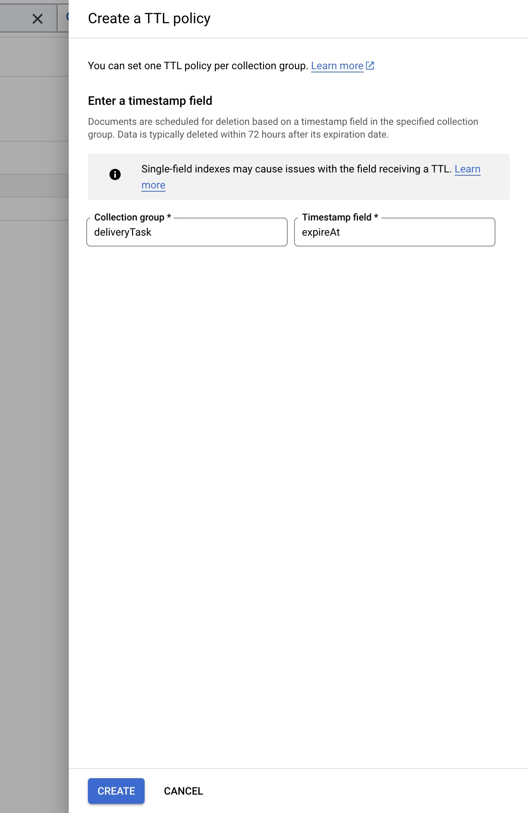
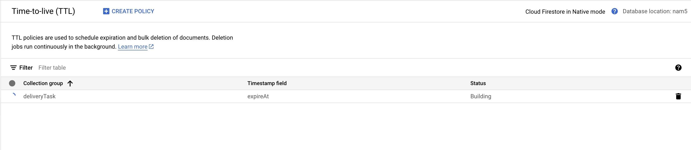
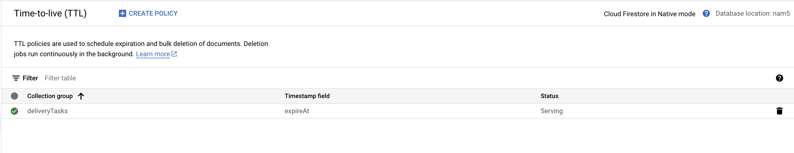

This folder contains code to connect to Firestore using the default Google
credentials. The FirestoreDatabaseClient connects to Firestore and runs
transactions on the Firestore database. This client generates Firestore
collections to store Task and Vehicle state.

As Cloud Functions can generate a large amount of state, it is recommended to
set up TTLs to expire your state in Firestore. See
[https://firebase.google.com/docs/firestore/ttl](https://firebase.google.com/docs/firestore/ttl)
for more details. The Task and Delivery Vehicle Firestore collections already
populate an 'expireAt' field with an hour delay from the last update to the
object which can be configured as the ttl field in Firestore. The expiration
date can be modified to change this in each of the transaction classes.

**Example setup for the deliveryTask collection**:

**Navigate to the ttl side panel in Firestore**:

<figure id = "image-3">
  
  <figcaption><b>Figure 3.</b> TTL sidepanel in Firestore. </figcaption>
</figure>

**Click on "Create Policy" and enter the collection group name for you tasks or
vehicles. The default name of the ttl field is "expireAt" set in the Cloud
Reference Solution**:

<figure id = "image-4">
  
  <figcaption><b>Figure 4.</b> Creating the ttl in Firestore. </figcaption>
</figure>

**The ttl will be provisioned and will have a green check when it is active**:

**Propagating (may take some time)**

<figure id = "image-5">
  
  <figcaption><b>Figure 5.</b> Firestore ttl propagating. </figcaption>
</figure>

**Active**

<figure id = "image-6">
  
  <figcaption><b>Figure 6.</b> Firestore ttl propagated and active. </figcaption>
</figure>

**Note**: Firestore ttls are only guaranteed to delete state based on a ttl
field within a 72 hour time window of thettl field's date. If you need the state
to be deleted exactly on the ttl date, set up a cron job to delete the state
manually instead.

## Contributors

Google maintains this article. The following contributors originally wrote it.

Principal authors:

- Ethel Bao | Software Engineer, Google Maps Platform
- Mohanad Almiski | Software Engineer, Google Maps Platform
- Naoya Moritani | Solutions Engineer, Google Maps Platform